## Hi there 👋 
    

***
### 🛠 Tech Stack & Tools
* **Languages:** `C++` ⚙️ | `Python` 🐍
* **Environment:** `Windows 10` 🪟 | `VS Code` 💻

---

### 🚀 Goal
I am an aspiring developer 💻 aiming to become an active contributor to the open-source community. My goal is to grow my skills and help improve projects through meaningful PRs! 🌍✨

### 🔍 Currently working on...
* 🛠 Exploring **Android Kernel** and **RKSU** modularity.
* 📖 Learning more about **System-level scripting**.

### Welcome to follow my channel❤️
